# How to use the ODM {.unnumbered}



## How-To guides

## 1) How to use templates

ODM Excel report templates provide you with an easy way to enter your wastewater and other environmental data into the relevant PHES-ODM tables (more information about the tables can be found in the [getting-to-know](explanation.qmd) and [tables](tables.qmd) sections). The templates also serve as an interactive way to get to know the ODM and can be found at the OSF.io [PHES-ODM reference file folder](https://osf.io/ab9se/files/osfstorage).

The guides below will walk you through each of the report templates. In these guides, "field" refers to a column in the template, and "entry" refers to a row of information that you entered. The guides also provide definitions and explanations for some terms; more complete information can be found in the Reference Guide - [Parts document](parts.qmd). If you have any questions or comments, you can post them on our [Discourse forum](https://odm.discourse.group).

As a starting point:

-   `Sample report table` and `Measure report table` are used for day-to-day reporting. You can record information about a sample in the `Sample report table`. Measures (or measurements) are recorded in the `Measure report table`. A measure is "measurement or observation of any substance including a biological, physical or chemical substance".

-   There are four optional tables that support the reporting of samples and measures:

    -   `Sample relationships table` is used only when you have samples that are pooled or split.

    -   `Measure set report table` can be used to link measures together.

    -   `Quality reports table` is used for detailed quality assurance and control reporting (you can, and should, record a quality flag attribute for each measure or sample in the `Measure report table` and `Sample report table`).

    -   `Public health actions report table` is for recording information on public health actions that are related to a given measure; whether a measure led to increased surveillance, or increased surveillance led to the measure is not made clear. The causality is specifically left ambiguous, but it illustrates the material connection between surveillance and action.

-   Typically, there is a one time initial setup where you will need to enter information into the `Sites table`, `Address table`, `Organization table`, and `Contact table`.

    -   `Sites table` is mandatory and records information about where testing is performed.

    -   `Address table`, `Organization table`, and `Contact table` optionally provide additional context, metadata, and contact information for sites and entities such as laboratories.

-   There are other optional supporting tables, such as `Protocols table` and `Instrument table`, where you can use the templates to record information about how samples are taken and how measures are reported. The `Calculations table` also helps in this regard, as it is where you can store information on the calculations or data treatments used to generate certain measurement values. You only need to compete these tables once and then update them as needed.

```         
-   `Protocol steps table` and `Protocol relationships table` are used alongside the `Protocols table`. 
```

-   Other supporting tables include `Polygon table`, which stores information about the sample shed, and `Polygon relationships table`, which describes relationships (such as overlap, co-location) of sample shed or other polygon areas. `Dataset table`, which stores information about the data custodian and owner of the data, and `Accessions table`, which stores linkages to external databases for things like sequencing data, help ensure that data is correctly linked and cited.

The templates contain four main types of fields; in these how-to guides they are colour-coded for instructional purposes:

-   **Identifier and unique identifier (red):** In these fields you will create a value that will be used to identify something. For instance, `Sample ID` is used to identify each unique sample. An identifier can be repeated between entries, while an unique identifier cannot. There is usually only one unique identifier per template sheet, and they correspond to the name of the template. For example, `Measure Report ID` for the `Measure report table` template, and `Contact ID` for the `Contact table` template.

-   **Drop-down and conditional drop-down menus (green):** These fields have a drop-down menu which contain the values that you can either select **or** type in. In conditional drop-down menus, the values may depend on what you entered in a previous field.

-   **Date fields (purple):** Dates are entered in these fields and must be in the form of the [ISO 8601](https://www.iso.org/iso-8601-date-and-time-format.html "https://www.iso.org/iso-8601-date-and-time-format.html") format: `yyyy-mm-dd`. All datetime fields also support entries for hours, minutes, and seconds: `2022-01-01T06:11:54` and `2022-01-01T06:11:54+13:30`

-   **Free form fields (blue):** In these fields, you can enter your data in any format that you wish. Any restrictions will be specified in the relevant sections. Keep in mind, different measures may have different data types that cannot be validated in Excel. The data type of a measure can be checked in the reference list for the measure. For example, the data type for [Sample temperature](parts.qmd#temp%22) is a real number.

### Conditional menus

Conditional menus use the FILTER function (which is present in Excel 2019 and later) and are only functional in the first three rows of their respective templates. In addition, the auto-calculation has been disabled. Thus, you will need to press the "Calculate Sheet" button, which is in the "Formulas" tab after entering the value in the field upon which the conditional menu is based upon; this button is outlined in red in the image below (the image is for Excel Online). For example, for the `Measure` conditional menu in the `Measure report` template, you would select a value in the `Class` field, press "Calculate Sheet" and then the correct values will show up in the menu of the `Measure` field.

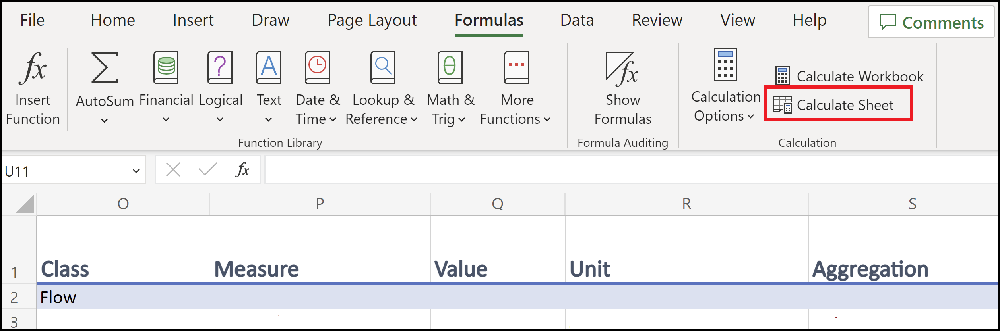

All of this was done because, in an online environment (such as Excel Online), the code for the conditional menus work can cause the templates to run very slowly. You can reactivate the auto-calculation if you wish. For further information about how to expand these menus to additional rows and other aspects of the templates, see [Notes regarding templates](#Notes-regarding-templates).

## 2) How to report Measures and Measure sets

In this guide you will learn how to record data in the `Measure report table` (or `measures` Excel tab) and the `Measure set report table` (or `measureSets` tab) templates. In the `Measure report table` template, each row represents a measure. Along the same lines, in the `Measure set report` template, each entry represents a collection or set of measures.

You can find additional information regarding terms and the colour-coding of columns at the beginning of this document ([How-To guides](how-to.qmd)) and the Reference Guide - [Parts document]((parts.qmd)).

## Quick Start

Below you will find the mandatory fields for the `Measure report table` and `Measure set report table` templates. You will also find definitions of these fields and examples of entries of data. A more detailed description of some of the key concepts can be found in the following section, Detailed description.

### `Measure report table` template

1.  **Mandatory fields**

-   **`Measure report ID`**: Unique identifier for the `Measure report table` template. Each value represents a measure.

-   **`Sample ID`**: Identifier for the sample that is associated with each measure.

-   **`Site ID`**: Identifier for the location where a sample was taken.

-   **`Analysis Date End`**: Date the measure was completed.

-   **`Specimen`**: Substance or thing upon which the observation was made. Specimens include `Population`, `Sample`, and `Site`. This field is only mandatory if there is more than one specimen type that is collected in the dataset.

-   **`Fraction analyzed`**: the fraction or portion of the wastewater that was analyzed (for example "liquid", "solid", "mixed").

-   **`Measure`**: A measurement or observation of any substance including a biological, physical or chemical substances.

-   **`Value`**: Value of the measure.

-   **`Unit`**: Units of a value.

-   **`Aggregation`**: Statistical measure that the measure represents (for example "mean", "single").

2.  **Examples**

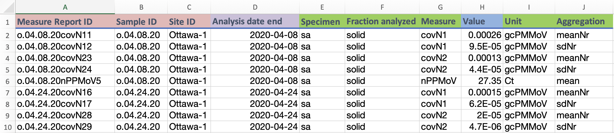 **this example data is pulled from open data sources using the ODM at the [Ontario Wastewater Surveillance Consortium](https://github.com/OntarioWastewaterSurveillanceConsortium/sars-cov-2-data/tree/main)**

### **Measure Sets Template**

1.  **Mandatory fields**

-   **`Report set ID`**: Unique identifier for the `Measure set report` template. Each value represents a group of related measures.

**note: the reason that the ID is the only mandatory field is because the value is referenced as a foreign key in the `Measure report table`, and as such the linkage can be found in that table rather than this one.**

3.  **Examples**

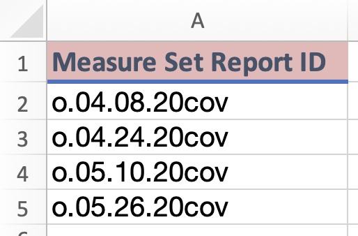 **this example data is pulled from open data sources using the ODM at the [Ontario Wastewater Surveillance Consortium](https://github.com/OntarioWastewaterSurveillanceConsortium/sars-cov-2-data/tree/main)**

4.  **Full example**

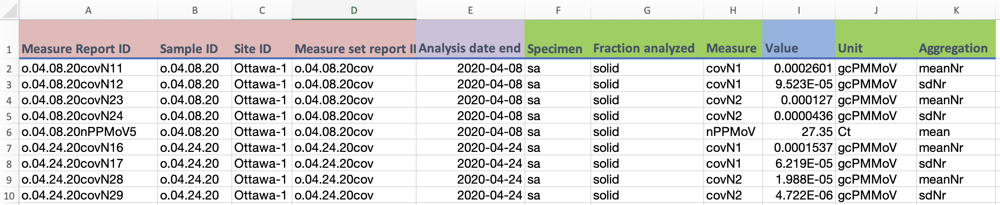

The above examples takes the previous example table, and adds the `Measure set report ID` column, to organize grouped measures together. In this case, mean and standard deviation measures of the SARS-CoV-2 N1 and N2 gene regions, and the PMMoV fecal biomarker standard, all from the same samples. The most basic `Measure set report table` would look the same as in the example at point 3 above, but optionally could include additional metadata about the set.

**this example data is pulled from open data sources using the ODM at the [Ontario Wastewater Surveillance Consortium](https://github.com/OntarioWastewaterSurveillanceConsortium/sars-cov-2-data/tree/main)**

## Detailed description

### **`Measures` template**

1.  **Columns A to I**

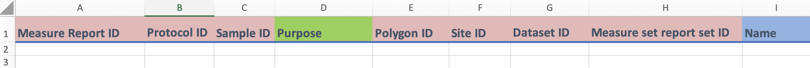{fig-align="center" width="679"}

```         
i)  Columns A-C, and E-H

    -   These are identifier fields.

    -   `Measure Report ID` (column A) is the unique identifier for this template, and it cannot be repeated. You can think of each `Measure Report ID` as representing a unique measure. The field can be any combination of letters or words up to 30 characters.

    -   You can repeat the other fields between entries (if needed). For instance, if you enter two different measures from the same sample, then the `Sample ID` (column C) will be the same.

    -   You may have already created these identifiers in another template. For instance, you may have created `Sample ID` in the `Sample report table` template.

ii) Column D

    -   `Purpose` has a drop-down menu. If you are unsure what to put, select `Regular` for regular pathogen surveillance. For more information on the different possible categories for purpose, please refer to [purposeSet](https://docs.phes-odm.org/sets.html#purposeSet).

iii) Column I

    -    `Name` is a free text and optional field for providing a general name for a measure. This can be repeated as well for internal tracking of measures.
```

2.  **Columns J to P**

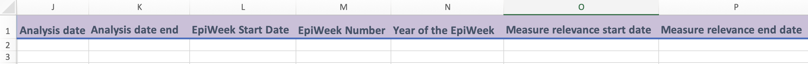{fig-align="center"}

```         
i)  Columns J to P
    -   These are date fields where you can enter the dates associated with your measure in the format yyyy-mm-dd. Including hours and minutes is optional, but all date-entries in columns J, K, L, and P use the ISO 8601 format. `2022-01-01T06:11:54` or `2022-01-01T06:11:54+13:30`

ii) Columns M and N
    -   M records the epi week of a measurement. Epi weeks are a way of standardizing time throughout the year by numbering the weeks, so the entry for this "date" field will be a whole number between 1 and 52. Similarly, N specifies the year that epi week belongs too, so only the year is recorded. 

iii) Columns O and P
    -   These measure relevance date fields were added in version 3.0.0 to better contextualize site specific or census-style data. For measures like population counts, for example, which may have time constraints on their validity. Fields in ODM can be editted at a later date and then the `Last editted` field (column AI) can be updated, but for items like population counts, they should not be overwritten because having the population from the time of the measure may be important for using and contextualizing the other measurement data. Hence, the validity date range fields.
```

3.  **Columns Q to AA**

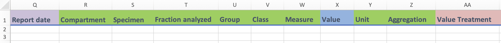{fig-align="center"}

```         
i) Columns R, S, and T
    -   `Compartment`, `Specimen` and `Fraction analyzed` have drop-down menus. In general these fields are optional, but are recommended (see next point for the exception).
    -   `Compartment` is only truly necessary to report if you are reporting measures from different compartments. If all your samples are wastwater (or just water) it becomes excessively repetitive to report it on each row.
    -   `Specimen` is mandatory when the ensemble of data you are entering has more than one type of specimen. If you are recordig both sample and site measures, for example, this needs to be made explicit.
    -   `Fraction analyzed` applies only for water and wastewater samples. You should record the fraction for all samples if the compartment type is water or wastewater.
    -   Of note is that if you generate wide names, these three fields are all mandatory parts to include in a wide name.
    
ii)  Columns U and V
    -   `Group` and `Class` help organize the `Measure` field by making specific measures easier to find (see the example in the next section). Both fields have a drop-down menu and are optional.
    -   Leave these fields **blank** if you do not use them.
    
iii) Column W
    -   `Measure` is where you select what is being measured. A measure in ODM is a "measurement or observation of any substance including a biological, physical or chemical substance".

iv) Column X
     -   `Value` is where you enter the value of your measure. For instance, if you recorded an `Environmental temperature` of 20 ^o^C, you would enter "20".
     -   Note: While the value you enter into this field can be of any data type, each measure is associated with a specific one. Data types for each measure can be found in the reference documentation. For example, the data type for `Environmental temperature` can be found [here](parts.qmd#airTemp).
     
v) Column Y
    -   `Unit` is where you enter the unit of your measure. 

vi) Column Z
    -   `Aggregations` is where you enter the aggregation of your value using a drop-down menu. For instance, does your value represent a mean, median, etc.

vii) Columnn AA
    -   `Value treatment` is a dropdown menu option that acts as a flag to describe what kind of data is being reported, ie. raw data, estimates, etc. For more information, please refer to ([valTreatSet](https://docs.phes-odm.org/sets.html#valTreatSet).
```

4.  **Columns AB to AK**

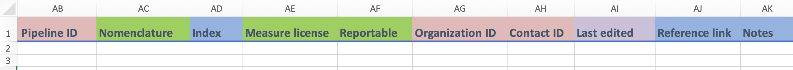{fig-align="center"}

```         
i)  Columns AB, AC, and AD
    -   AB is an identifier field used for connecting to detailed calculations or data treatment details in the `Calculations table`, while AC contains drop-down menus, and AD is a free text field.
    -   `Nomenclature` is used when reporting a variant or disease to specify which naming convention (nomenclature) was used, to ensure that it can be matched up with the same measure reported under different naming conventions.
    -   `Index` (column AD) is used if you have multiple entries with the same values in most of the other fields; an example is when you make replicates of measures. If this is the case you can enter "1", "2", etc. in this field to differentiate them.

ii) Column AE and AF
    -   These are fields which contain drop-down menus.
    -   `Measure license` (column V) refers to the access and use licensing of the measure that you are entering. For a full list of current license categories, please see [licSet](https://docs.phes-odm.org/sets.html#licSet).
    -   `Reportable` (column W) is where you can indicate if the measure should not be used for regular reporting due to quality concerns. It takes a `TRUE` or `FALSE` value. You can record more details of the quality concerns in the `Quality reports table` template.
    
iii) Column AG and AH
     -   These are identifier fields that are used to indicate the organization and contact person associated with the entry.
     
iv) Column AI, AJ, and AK
    -   `Last edited` is where you can indicate the date when the entry was last updated. This field is used when you modify an entry after your initial recording. Leave this field blank if the entry was entered with no updates.
    -   `Reference link` is used to point out to an external reference for a single measure, if needed.
    -   `Notes` is free text field for recording any additional details that users may feel are important to include.
```

### **`Measure set report` template**

1.  **Columns A to G**

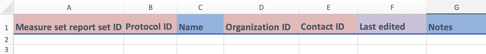{fig-align="center" width="671"}

```         
i)     Columns A, B, D and E

    -   These are identifier fields.

    -   `Measure set report set ID` (column A) is the unique identifier for this template, and cannot be repeated between entries. In essence, each value of `Measure set report set ID` represents a unique measure set. This field can be any combination of letters or words up to 30 characters.

    -   For the rest, you can repeat the identifier between entries (if needed). For instance, if you are entering two different measure sets that came from the same organization, then the `Organization ID` (column D) will be the same.

    -   You may have already created these identifiers in another template. For instance you may have created `Organization ID` in the `Organization table` template.

ii)    Columns C and G

    -   These are free form fields in which you can enter the indicated information. `Name` (column C) refers to the name that you have given to the measure set.

iii)   Column F

    -   `Last edited` is a date field in which you can enter the date when the entry was last updated. This field is used when you modify an entry after your initial recording. Leave this field blank if the entry was entered with no updates.
```

You have now entered your data in the `Measure report` and `Measure set report` templates, congratulations!

## 3) How to report samples and sample relationships:

In this guide you will learn how to enter information about samples and sample relationships into their respective templates. In the `Sample report table` (or `samples` tab) template, each entry represents a sample. A sample is the wastewater that you collected so that measures can be made - but it may also be a sample from a surface, from air, or other environmental material. Along the same lines, each entry in the `Sample relationships table` (or the `sampleRelationships` tab) template represents an interaction (or relationship) between two samples in the form "subject - relationship - object". So, to specify that Sample A is a field sample replicate of Sample B, you would enter `Sample ID` of A - `Field sample replicate` - `Sample ID` of B.

You can find additional information regarding terms and the colour-coding of columns at the beginning of this document ([How-To guides](how-to.qmd)) and the [Reference Guide - Parts document](parts.qmd).

## Quick Start

Below you will find the fields that are mandatory for the `Sample report` and `Sample relationships` templates. You will also find definitions of these fields and examples of entries of data. A more detailed description of some of the key concepts can be found in the following section, Detailed Description.

### Samples Template

1.  **Mandatory fields**

-   **`Sample ID`**: Unique identifier for the `Sample report` template. Each value represents a sample.

-   **`Site ID`**: Identifier for the location where a sample was taken.

-   **`Sample material`**: Type of material that the sample is made of.

-   **`Sample collection type`**: Method used to collect the sample.

-   **`Collection period`**: The time period over which the sample was collected, in hours.

-   **`Collection number`**: The number of subsamples that were combined to create the sample. Use NA for continuous, proportional or passive sampling.

-   **`Collection date time`**: The date, time and time zone the sample was taken.

2.  **Examples**

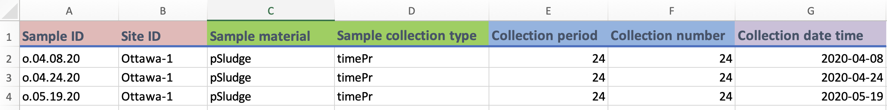

**this example data is pulled from open data sources using the ODM at the [Ontario Wastewater Surveillance Consortium](https://github.com/OntarioWastewaterSurveillanceConsortium/sars-cov-2-data/tree/main)**

### Sample Relationships Template

1.  **Mandatory fields**

-   **Synthetic ID for the sampleRelationships table**: A unique identifier for each row of the `Sample relationships table`. Can be any combination of characters, as long as there are fewer than 30.

-   **`Sample ID object`**: The object (or one of the samples) of a relationship between two samples. This will always be a `Sample ID` that was previously created in the `Sample report` template.

-   **`Relationship`**: Describes the relationship between two samples. For the list of possible relationships, please refer to [sampleRelSet](https://docs.phes-odm.org/sets.html#sampleRelSet).

-   **`Sample ID subject`**: The subject (or one of the samples) of a relationship between two samples. This will always be a `Sample ID` that was previously created in the `Sample report` template.

2.  **Examples**

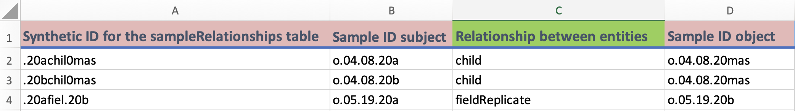

## Detailed Description

### **`Sample report table` template**

**Columns A to J**

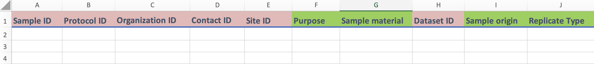{fig-align="center"}

```         
i)  Columns A to E, and H:

    -   These are identifier fields.

    -   `Sample ID` (column A) is the unique identifier for this template and cannot be repeated between entries. You can think of each `Sample ID` value as representing a unique sample. This field can be any combination of letters, numbers, or words up to 30 characters.

    -   For the rest of the fields, you can repeat values between entries. For instance, if you are entering two different samples from the same site, then the `Site ID` (column E) will be the same.

    -   The sample logic applies for sampling protocols (`Protocol ID`), for the individual or organization collecting the sample (`Organization ID` and `Contact ID`), and the dataset the data is found in (`Dataset ID`).
    
    -   You may have already created these identifiers in another template. For instance you may have created `Site ID` in the `Sites table` template.

ii) Columns F to G:

    -   These are fields that contain drop-down menus where you can enter information regarding the `Purpose` (column F, [purposeSet](https://docs.phes-odm.org/sets.html#purposeSet)) and `Sample material` (column G, [sampleMatSet](https://docs.phes-odm.org/sets.html#sampleMatSet)) of your sample.
    
ii) Columns I to J:

    -   These are fields that contain drop-down menus where you can enter information regarding the `Sample origin` (column I, [originSet](https://docs.phes-odm.org/sets.html#originSet)) and the `Replicate type` (column J, [replicateSet](https://docs.phes-odm.org/sets.html#replicateSet)) of your sample.
    
```

2.  **Columns K to Q**

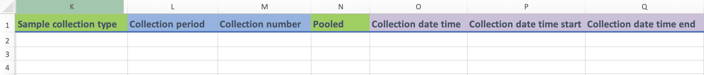

```         
i) Columns K, N:

    -   These fields contain drop-down menus and are related to various characteristics of your sample.

    -   `Sample collection type` (column K, [collectSet](https://docs.phes-odm.org/sets.html#collectSet)) refers to the collection technique you used to obtain the sample.

    -   `Pooled` (column O, [booleanSet](https://docs.phes-odm.org/sets.html#booleanSet)) refers to whether or not the sample that you are entering is made up of multiple parent samples; a combination of multiple samples.
    
ii) Columns L to M:

     -   These are free form fields.
     
     -   `Collection period` (column L) refers to the number of hours that you took to collect the sample. Please note that this is one field in the ODM where the units are implied, and **must be recorded in hours**.
     
     -   `Collection number` (column M) refers to the number of subsamples that were used to create Sample that you are entering. For grab samples this value will always just be 1.
     
iii) Columns O to Q:

    -   These fields are datetime fields to record details about when exactly a sample was collected. These dates will be in the format yyyy-mm-dd. Including hours and minutes is optional, but all date-entries use the ISO 8601 format. `2022-01-01T06:11:54` or `2022-01-01T06:11:54+13:30.`
    
    -   For single collection or grab samples, users can use `Collection date time` (Column O) to record the date and time of colelction. 
    
    -   For composite or agragated samples, users can use `Colelction date time start` (Column P) to record the date and time that sample collection was begun, and `Colelction date time end` (Column Q) to record when the collection was halted.
    
```

3.  **Columns R to V**

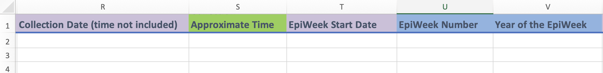

```         
i)  Columns R and T:

    -   These are optional date fields that are related to your sample. These dates will be in the format yyyy-mm-dd. Including hours and minutes is optional, but all date-entries use the ISO 8601 format. `2022-01-01T06:11:54` or `2022-01-01T06:11:54+13:30.`
    
    -   `Collection Date (time not included)` (Column R) is where you can enter the date of collection when time wasn't recorded. THis is an optional field because it records less data, but is a good option for programs where detailed time stamps may be unfeasible - including for composite samples. 
    
    -   `EpiWeek Start Date` (Column T) is an optional date field used when recording [epiWeeks](https://epiweeks.readthedocs.io/en/stable/background.html) (columns U and V). This specifies the start date of the EpiWeek to avoid confusion due to differences in USCDC and ISO8601 reporting standards.
    
ii) Column S:

    -   `Approximate Time` (column S) is an optional time field when using `Collection Date (time not included)`. If users did have some information about time, this is a categorical drop down field to report approximate times of day in which the sample was collected. For information on these categories, please see [collAppxSet](https://docs.phes-odm.org/sets.html#collAppxSet).

iii) Columns U and V:

    -   These are optional free-text fields to be used as accessories to a date field. 
    
    -   `EpiWeek Number` (collumn U) specifies the number of the EpiWeek (between 1 and 52 or 53) of sample collection. 
    
    -   `Year of the EpiWeek` (column V) specifies the year of the epiWeek. 
    
    -   In order for epiWeek information to be useful, **all three pieces (`EpiWeek Start Date`, column T; `EpiWeek Number`, collumn U; and `Year of the EpiWeek`, column V) must be present and recorded**.
```

4.  **Columns W to AA**

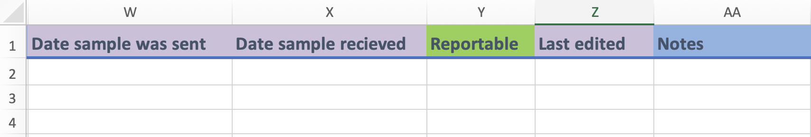

```         
i)  Columns W, X, and Z:

    -   These fields are datetime fields to record details about when exactly a sample was sent from the collection point to the lab, and when it was recieved in the analysis lab. These dates will be in the format yyyy-mm-dd. Including hours and minutes is optional, but all date-entries use the ISO 8601 format. `2022-01-01T06:11:54` or `2022-01-01T06:11:54+13:30.`
    
    -   `Date sample was sent` (column W) records when a sample leaves the collection point and is sent to the lab for analysis. `Date sample recieved` (Column X) records when that sample then arrives in the lab for analysis. These two fields, when combined with `Collection date time` and `Analysis date time start` (from the `Measure report table`), give a complete timeline from collection to analysis. This helps provide contextual metadata for how long samples are sitting, and any implications that may have on the measurement results.
    
    -   `Last edited` ( Column Z) is where you can enter the date when the entry was last updated. This field is used when you modify an entry after your initial recording. Leave this field blank if the entry was entered with no updates.
    
ii) Columns Y and AA:

    -   `Reportable` (column U, [booleanSet](https://docs.phes-odm.org/sets.html#booleanSet)) is a drop-down menu field where you can indicate if the sample should not be used for regular reporting due to quality concerns. You can record more details of the quality concerns in the `Quality reports` table.
    
    -   `Notes` (column W) is a free form field where you can indicate anything of interest.
    
```

### **`Sample relationships` template**

1.  **Columns A to F**

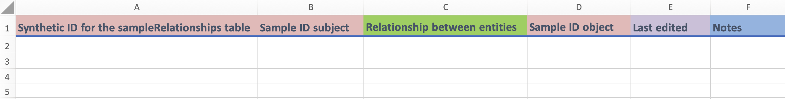{fig-align="center"}

```         
i)  Columns A, B, and D:

    -   These are identifier fields.
    
    -   `Synthetic ID for the sampleRelationships table` is a unique identifier for each row in the "Sample relationships table`, and they cannot be repeated. This operates as the primary key for this table.
    
    -   Both of the identifiers for subject (Column B) and object (Column D) are `Sample ID` values and represent samples. You would have created them previously in the `Sample report` template. Neither of them are unique identifiers and, thus, can be repeated between entries.

ii) Columns B:

    -   `Relationship` (Column C, [sampleRelSet](https://docs.phes-odm.org/sets.html#sampleRelSet) is a drop-down menu field where you can select the type of relationship between two samples. For instance, if Sample B was a child of Sample A, you would put the `Sample ID` of Sample A in the `Sample ID subject` field (column B), and the `Sample ID` of Sample B in `Sample ID object` field (column D). Then you would chose `Child relationship` from the menu in this column.

iii) Columns E and F:

     -   These are a date field (column E) and a free form field (column F) where you can enter in the indicated information.
     
     -   `Last edited` (column E) is where you can enter in the date when the entry was last updated. This field is used when you modify an entry after your initial recording. Leave this field blank if the entry was entered with no updates.

    -   `Notes` (column F) is a free form field where you can indicate anything of interest.
    
```

You have now entered your data in the `Sample report` and `Sample relationships` templates, congratulations!

## 4) How to record a protocol

In this guide you will learn how to enter protocols, protocol steps and protocol relationships into their respective templates. A protocol is "A procedure for collecting a sample or performing a measure". Each entry in the `Protocols table` (or [protocols](https://docs.phes-odm.org/tables.html#protocols)) template represents a unique protocol. A protocol is made up of protocol steps. In the `Protocol steps table` (or [protocolSteps](https://docs.phes-odm.org/tables.html#protocolSteps)) template, each entry is one of these steps. Finally, protocols and protocol steps can be linked to each other. Each entry in the `Protocol relationships` (or [protocolRelationships](https://docs.phes-odm.org/tables.html#protocolRelationships)) template represents one of these relationships in the form, "subject - relationship - object". So, for example, if you want to specify that Protocol step A needs to be done before Protocol step B, you would enter the `Protocol step ID` of A - `Is Before` - `Protocol Step ID` of B.

You can find additional information regarding terms and the colour-coding of columns at the beginning of this guide ([How-To guides](how-to.qmd)) and the [Reference Guide - Parts document](https://docs.phes-odm.org/tables.html).

## Quick Start

Below you will find the fields that are mandatory for the `Protocols`, `Protocol steps` and `Protocol relationships` templates. You will also find definitions of these fields and examples of entries of data. A more detailed description of some of the key concepts can be found in the following section, Detailed Description.

### **`Protocol steps` template**

1.  **Mandatory fields**

-   `Protocol Step ID`: The unique identifier for the `protocol steps` template. Each value represents a protocol step.

-   `Measure`: A measurement or observation of any substance including a biological, physical or chemical substance.

-   `Method`: A procedure for collecting a sample or performing a measure.

-   `Value`: Value of the entry. This is only mandatory if the entry is a measure.

-   `Unit`: The units of the value. This is only mandatory if the entry is a measure.

-   `Aggregation`: Statistical measures used to report a measure (for example, "mean"). This is only mandatory if the entry is a measure.

2.  **Examples**

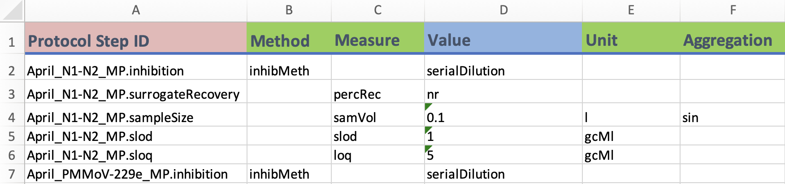

**this example data is pulled from open data sources using the ODM at the [Ontario Wastewater Surveillance Consortium](https://github.com/OntarioWastewaterSurveillanceConsortium/sars-cov-2-data/tree/main)**

### **`Protocols` template**

1.  **Mandatory fields**

-   `Protocol ID`: The unique identifier for the `Protocols` template. Each value represents a protocol.

2.  **Examples**

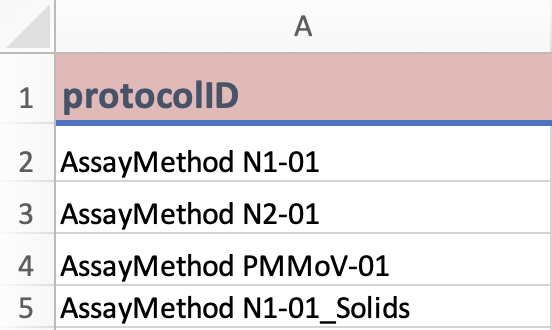 **this example data is pulled from open data sources using the ODM at the [Ontario Wastewater Surveillance Consortium](https://github.com/OntarioWastewaterSurveillanceConsortium/sars-cov-2-data/tree/main)**

### **`Protocol relationships` template**

1.  **Mandatory fields**

-   `Synthetic ID for the protocolRelationships table`: A unique identifier for each row of the `Sample relationships table`. Can be any combination of characters, as long as there are fewer than 30.

-   `Protocol ID container`: The unique identifier for the `Protocol relationships` template. Each value represents a protocol, and the step(s) and other protocol(s) that make it up. This identifier should also be a `Protocol ID` that was created using the `Protocols` template.

-   `Protocol ID object`: Identifier of the object of a relationship between a protocol, and a protocol step or protocol. This is only mandatory if the object is a protocol.

-   `Step ID Object`: Identifier of the object of a relationship between a protocol step, and a protocol step or protocol. This is only mandatory if the object is a protocol step.

-   `Relationship between entities`: Describes the relationship between the subject and object.

-   `Protocol ID subject`: Identifier of the subject of a relationship between a protocol, and a protocol step or protocol. This is only mandatory is the subject is a protocol.

-   `Step ID Subject`: Identifier of the subject of a relationship between a protocol step, and a protocol step or protocol. This is only mandatory is the subject is a protocol step.

2.  **Examples**

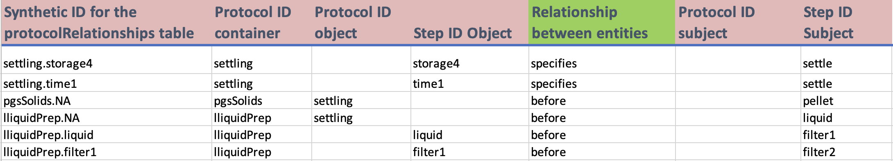 **this example data is pulled from open data sources using the ODM at the [Ontario Wastewater Surveillance Consortium](https://github.com/OntarioWastewaterSurveillanceConsortium/sars-cov-2-data/tree/main)**

## Detailed Description

### **`Protocol steps` template**

1.  **Columns A to G**

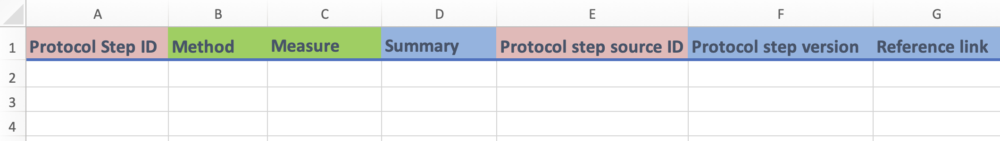{fig-align="center"}

```         
i)  Column A and E:
    -   These are identifier fields.
    -   `Protocol step ID` (column A) is the unique identifier field for this template and cannot be repeated between entries. You can think of each `Protocol Step ID` value as representing a unique protocol step. This field can be any combination of letters or words up to 30 characters.
    -   `Protocol step source` (column E) specifies the protocol step that you used as a basis for the given protocol step (it will be a previous `Protocol step ID`).
ii) Columns B to C:
    -   These are fields with drop-down menus.
    -   You only need to enter a value into `Method` (column B) *or* `Measure` (column C). The former is for when you are entering a method as a protocol step. The latter is when you are entering a measure as a protocol step. Leave the other field **blank**.
iii) Columns D, F and G:
     -   These are free form fields.
     -   `Summary` (column D) is a short description of the protocol step that you are entering.
     -   `Protocol step version` (column F) specifies the version of a given protocol step.
     -   `Reference link` (column G) is used to report a URL or hyperlink to where the protocol step has been described elsewhere.
```

2.  **Columns H to O**

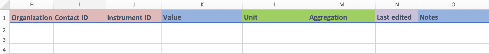{fig-align="center"}

```         
i)  Columns H to J:
    -   These are identifier fields.
    -   You can repeat values between entries. For instance, if you are entering two different protocol steps from the same organization, then the `Organization ID` field (column H) will be the same.
ii) Column K:
    -   `Value` is a free form field where, if the protocol step is a measure, you can enter its value.
    -   Of note, for some measures and methods, they can take enumerated values, so this field can take categorical inputs as well.
iii) Columns L and M:
     -   These fields contain conditional drop-down menu fields.
     -   `Unit` (column L) depends on what you entered in `Measure` (column C). This field is only applicable if the protocol step is a measure.
     -   `Aggregation` (column M) depends on what you entered in `Unit` (column L). This field is only applicable if the protocol step is a measure.
iv) Columns N and O:
    -   These are a date field (column N) and a free form field (column O) where you can enter in the indicated information.
    -   `Last edited` (column N) is where you can enter the date when the entry was last updated. This field is used when you modify an entry after your initial recording. Leave this field blank if the measure was entered with no updates. This date will be in the format yyyy-mm-dd. Including hours and minutes is optional, but all date-entries use the ISO 8601 format. `2022-01-01T06:11:54` or `2022-01-01T06:11:54+13:30.`
```

### **`Protocols` template**

1.  **Columns A to J**

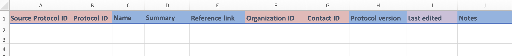{fig-align="center"}

    i)  Columns A and B; F and G
        -   These are identifier fields.
        -   `Protocol ID` (column B) is the unique identifier for this template, and *cannot be repeated* between entries. In essence, each value of `Protocol ID` represents a unique protocol. This field can be any combination of letters or words up to 30 characters.
        -   `Source Protocol ID` (column A), `Organization ID` (column F), and `Contact ID` (column G) are identifier fields that can repeat values between entries.
        -   `Source Protocol ID` (column A) is where you can enter the `Protocol ID` of the protocol that served as the basis for the protocol that is currently being entered.
        -   `Organization ID` (column F) records the linked organization who created or designed the protocol.
        -   `Contact ID` (column G) records the ontact information for questions about the protocol.
        
    ii) Columns C to E:
        -   These are free form fields in which you can enter the indicated information.
        -   `Name` (column D) refers to the name that you have decided to give your protocol.
        -   `Summary` (column D) and `Reference link` (column E) record a narrative summary or the protocol, and a URL for web details about the protocol, repectively. 

    iii) Columns H, J:
        -   These are free form fields.
        -   `Protocol version` (column I) is where you can indicate the version of the protocol that you are entering.
        -   `Notes` (column J) records any additional details about the protocol.
        
    vi) Columns I:
         -   `Last edited` is a date field where you can enter the date when the entry was last updated. This field is used when you modify an entry after your initial recording. Leave this field blank if there have been no updates.

### **`Protocol relationships` template**

1.  **Columns A to I**

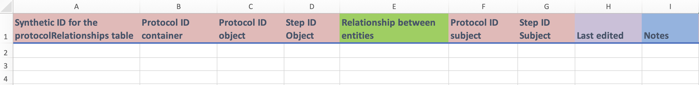{fig-align="center"}

    i)  Columns A to D; F and G:

        -   These are identifier fields.
        -   `Synthetic ID for the protocolRelationships table` is a unique, autoincremental ID generated to produce a unique identifier and primary key for each row of the protocolRelationships table. Often by concatenating the object (column C or D), the relationship (column E), the subject (column F or G), and the row number. This identifier is not repeated.
        -   All the remaining identifiers (columns B to D; F and G) are either `Protocol ID` values or `Protocol Step ID` values, and represent protocols and protocol steps, respectively. This includes `Protocol ID Container` (column A), which is a `Protocol ID` that contains the relationships that you are entering in this template. Note that none of these fields are unique identifiers and, thus, they can be repeated between entries.
        -   You should only enter a value for one of the two `object` columns (column B and C); this depends on whether the object of the relationship that you are entering is a protocol or a protocol step. The same is true for the two `subject` columns (column E and F).
        -   An example will be given in point (ii) below.

    ii) Column E:
    
        -   `Relationship` contains a drop-down menu; it is where you can select the type of relationship that is being entered.
        -   For example, pretend you wanted to enter a relationship stating that Protocol step A takes place before Protocol step B in a particular protocol container. You would enter the relevant identifiers in the `Step ID Object` field (column B) and the `Step ID subject` field (column F). You would then select `Is Before` from the `Relationship` field. Finally, to identify this relationship, you would enter in the identifier in the `Protocol ID Container` field (column A)

    iii) Columns H and I:

         -   These are a date field (column G) and a free form field (column H) where you can enter in the indicated information.
         -   `Last edited` (column G) is where you can enter the date when the entry was last updated. This field is used when you modify an entry after your initial recording. Leave this field blank if the measure was entered with no updates.

You have now entered your data in the `Protocol steps`, `Protocols` and `Protocol relationships` templates, congratulations!

## 5) How to report metadata

In this guide you will learn how to enter in the metadata of your wastewater data through a series of templates. Each entry in a template will usually represents what is found in the title of the template. For instance, in the `Organizations` template each row will represent an organization. In the context of the PHES-ODM, metadata is anything that gives general information about the data that you are entering and is not found in the templates related to measures, protocols and samples.

You can find additional information regarding terms and the colour-coding of columns at the beginning of this guide ([How-To guides]) and the Reference Guide - Parts document.

## Quick Start

Below you will find the fields that are mandatory for the metadata-related templates. You will also find definitions of these fields and examples of entries of data. A more detailed description of some of the key concepts can be found in the following section, Detailed Description.

### **`Address` (or `addresses`) template**

1.  **Mandatory fields**

-   `Address ID`: The unique identifier for the `Address` template. Each value represents an address.

-   `Dataset ID`: The identifier of the dataset that stores information for measures, samples and other reporting tables.

-   `Address line 1`: Line 1 (the street name, number and direction) for a given address of a site or organization.

-   `City`: The city where a site or organization is located; part of the address.

-   `State, province or region`: The state, province, or region where a site or organization is located; part of the address.

-   `Country`: The country where a site or organization is located; part of the address.

2.  **Examples**

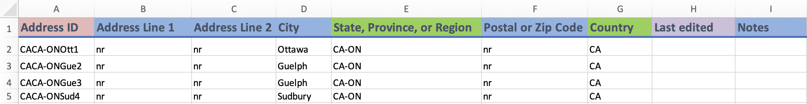
**this example data is pulled from open data sources using the ODM at the [Ontario Wastewater Surveillance Consortium](https://github.com/OntarioWastewaterSurveillanceConsortium/sars-cov-2-data/tree/main)**

### **`Contact` (or `contacts`) template**

1.  **Mandatory fields**

-   `Contact ID`: The unique identifier for the `Contact` template. Each value represents a contact person.

-   `Organization ID`: An identifier for the organization to which the contact person is affiliated.

-   `Email`: Contact e-mail address.

2.  **Examples**

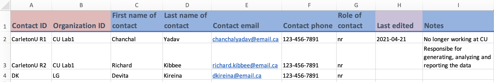
**this example data is adapted from open data sources using the ODM at the [Ontario Wastewater Surveillance Consortium](https://github.com/OntarioWastewaterSurveillanceConsortium/sars-cov-2-data/tree/main)**

### **`Dataset` (or `datasets`) template**

1.  **Mandatory fields**

-   `Dataset ID`: A unique identifier for the `Dataset` template. Each value represents a dataset.

-   `License`: The license of the dataset.

-   `Data custodian`: The data custodian of the database. This is represented by an `Organization ID` and would have been created in the `Organization` template.

2.  **Examples**

*Images will be added*

### `Instrument` (or `instruments`) Template

1.  **Mandatory fields**

-   `Instrument ID`: The unique identifier for the `Instrument` template. Each value represents an instrument.

-   `Dataset ID`: The identifier of the dataset that stores information for measures, samples and other reporting tables.

-   `Model`: Model number or version of the instrument.

-   `Instrument type`: The type of instrument used to perform the measurement.

2.  **Examples**

*Images will be added*

### `Organization` (or `organizations`) template

1.  **Mandatory fields**

-   `Organization ID`: The unique identifier for the `Organization` template. Each value represents an organization to which the reporter is affiliated.
-   `Address ID`: An identifier for the address of the organization.

2.  **Examples**

*Images will be added*

### `Polygon` (or `polygons`) template

1.  **Mandatory fields**

-   `Polygon ID`: The unique identifier for the `Polygon` template. Each value represents a polygon.
-   `Type of geography`: Type of geography that is represented by the polygon.
-   `Well-known text`: Well-known text of the polygon.
-   `European Petroleum Survey Group Coordinates`: A code that specifies a given geospatial area.

2.  **Examples**

*Images will be added*

### `Quality reports` (or `qualityReports`) template

1.  **Mandatory fields**

-   `Quality report ID`: The unique identifier for the `Quality reports` template. Each value represents a quality issue that you wish to report.
-   `Report ID`: An identifier for a measure. This is only mandatory if the entry is about a measure.
-   `Sample ID`: An identifier for a sample. This is only mandatory if the entry is about a sample.
-   `Report set ID`: An identifier that links together a group of related measures. This is only mandatory if the entry is related to a measure set.
-   `Quality flag`: A field for reporting any quality concerns for a sample or measure.

2.  **Examples**

*Images will be added*

### `Sites` (or `sites`) template

1.  **Mandatory fields**

-   `Site ID`: The unique identifier for the `Sites` template. Each value represents the site where a wastewater sample was taken.
-   `Site type`: Type of site where a sample was taken.
-   `Sample shed`: A geographic area, physical space, or structure. A sample is taken from a sample shed for a representative measurement of a substance.
-   `Contact ID`: An identifier for a given contact person.
-   `Latitude`: Latitude in decimal coordinates of the site.
-   `Latitude`: Longitude in decimal coordinates of the site.
-   `European Petroleum Survey Group Coordinates`: A code that specifies a given geospatial area.

2.  **Examples**

*Images will be added*

## Detailed Description

### `Address` template

1.  **Columns A to E**

    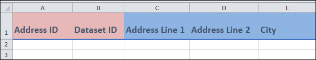{fig-align="center"}

    i)  Columns A and B:

        -   These are identifier fields.

        -   `Address ID` (column A) is the unique identifier for this template, and cannot be repeated between entries. You can think of each `Address ID` value as representing a unique address. This field can be any combination of letters or words up to 30 characters.

        -   For `Dataset ID` (column B), you can repeat the value between entries (if needed). For instance, if you are entering two different addresses from the same dataset, then this column will be the same.

        -   You may have already created the `Dataset ID` in the `Dataset` template.

    ii) Columns C to E:

        -   These are free form fields in which you can enter various information about the address.

2.  **Columns F to J**

    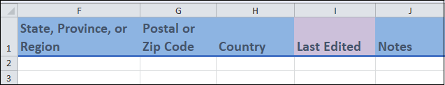{fig-align="center"}

    i)  Columns F to J:

        -   Most of these are free form fields where you can enter the indicated information about the address.

        -   `Last edited` (column I) is a date field where you can enter the date when the entry was last updated. This field is used when you modify an entry after your initial recording. Leave this field blank if the measure was entered with no updates.

            This date will be in the format yyyy-mm-dd. Including hours and minutes is optional, but all date-entries use the ISO 8601 format. `2022-01-01T06:11:54` or `2022-01-01T06:11:54+13:30.`

### `Contact` template

1.  **Columns A to E**

    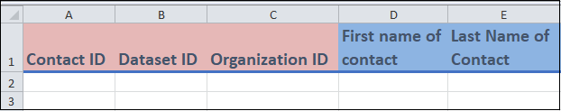{fig-align="center"}

    i)  Columns A to C:

        -   These are identifier fields.

        -   `Contact ID` (column A) is the unique identifier for this template, and cannot be repeated between entries. You can think of each `Contact ID` value as representing a unique contact person. This field can be any combination of letters or words up to 30 characters.

        -   For the rest of the fields, you can repeat the values between entries (if needed). For instance, if you are entering two different contacts that came from the same organization, then the `Organization ID` (column C) will be the same.

        -   You may have already created these Identifiers in another template. For instance you may have created `Organization ID` in the `Organization` template.

    ii) Columns D and E:

        -   These are free form fields in which you can enter the name of the contact.

2.  **Columns F to J**

    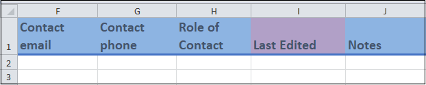{fig-align="center"}

    i)  Columns F to J:

        -   Most of these fields are free form in which you can enter various information regarding the contact.
        -   `Last Edited` (column I) is a date field where you can enter the date when the entry was last updated. This field is used when you modify an entry after your initial recording. Leave this field blank if the measure was entered with no updates.

### `Dataset` template

1.  **Columns A to G**

    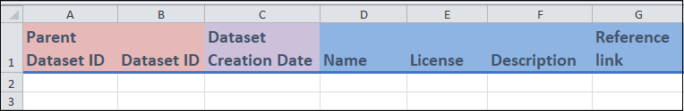{fig-align="center"}

    i)  Columns A and B:

        -   These are identifier fields.

        -   `Dataset ID` (column B) is the unique identifier for this template, and cannot be repeated between entries. You can think of each value of `Dataset ID` as representing a unique dataset. This field can be any combination of letters or words up to 30 characters.

        -   For `Parent dataset ID` (column A), you can repeat the value between entries (if needed). For instance, if you are entering two different datasets that came from the same parent dataset, then the `Parent dataset ID` will be the same.

    ii) Column C

        -   `Dataset creation date` is a date field where you can enter the date that the dataset was created.

    iii) Columns D to G:

         -   These are free form fields in which you can enter various information related to the dataset.

2.  **Columns H to N**

    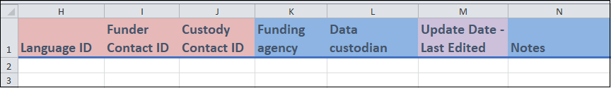{fig-align="center"}

    i)  Columns H to L:

        -   These are identifier fields.
        -   For information regarding funders, you can enter their `Funder Contact ID` (which is a `Contact ID` created in the `Contact` template) and `Funding Agency` (which is a `Organization ID` created in the `Organization` template) in columns I and K.
        -   For information regarding Data Custodians, you can enter their `Custody Contact ID` (which is a `Contact ID` created in the `Contact` template) and `Data Custodian ID` (which is a `Organization ID` created in the `Organization` template) in columns J and L.

    ii) Columns M and N:

        -   These are a date field (column M) and a free form field (column N) where you can enter in the indicated information.
        -   `Last edited` (column M) is the date when the entry was updated. This field is used when you modify an entry after your initial recording. Leave this field blank if the measure was entered with no updates.

### `Instrument` template

1.  **Columns A to G**

    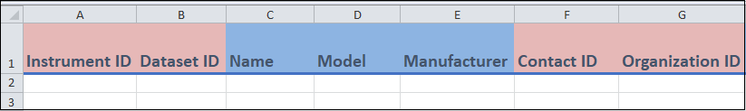{fig-align="center"}

    i)  Columns A, B, F and G:
        -   These are identifier fields.

        -   `Instrument ID` (column A) is the unique identifier for this template, and cannot be repeated between entries. In essence, you can think of each `Instrument ID` value as representing a unique instrument. This field can be any combination of letters or words up to 30 characters.

        -   For the rest of the columns, you can repeat the value between entries (if needed). For instance, if you are entering two different instruments from the same dataset, then `Dataset ID` column will be the same.

        -   You may have already created some of the identifiers in other templates. For instance, you may have already created `Dataset ID` in the `Datasets` template.
    ii) Columns C to E
        -   These are free form fields where you can enter the `Name` (column C), `Model` (column D) and `Manufacturer` (column E) of the instrument.

2.  **Columns H to N**

    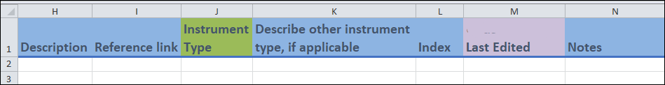

    i)  Columns H, I, L to N:
        -   Most of these fields are free form in which you can enter relevant information regarding your instrument
        -   You can use `Index` (column L) to differentiate two entries of data that are the same in the other fields.
        -   `Last Edited` (column M) is a date field where you can indicate the date when the entry was updated. This field is used when you modify an entry after your initial recording. Leave this field blank if the measure was entered with no updates.
    ii) Columns J and K:
        -   For `Instrument type` (column J), you can select from the drop-down menu the type of instrument. If you do not see your instrument, you can enter `Other instrument`.

        -   If you entered `Other instrument` in the `Instrument type` field, you can use the `Describe other instrument type, if applicable` field (column K) to describe your instrument.

### `Organization` template

1.  **Columns A to E**

    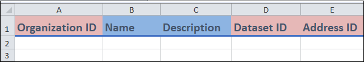

    i)  Columns A, D and E:
        -   These are identifier fields.

        -   `Organization ID` (column A) is the unique identifier for this template, and cannot be repeated between entries. You can think of each value of `Orgnization ID` as representing a unique organization. This field can be any combination of letters or words up to 30 characters.

        -   For the rest of the columns, you can repeat the value between entries (if needed). For instance, if you are entering two different organizations with the same address, then the `Address ID` will be the same.

        -   You may have already created some of the identifiers in other templates. For instance, you may have already created the `Address ID` in the `Address` template.
    ii) Columns B and C:
        -   These columns are free form fields in which you can enter additional information regarding the organization.

2.  **Columns F to J**

    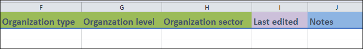

    i)  Columns F to H:
        -   These are fields with drop-down menus where you can select various characteristics of the organization that you are entering.
    ii) Columns I and J:
        -   These are a date field (column I) and a free form field (column J) where you can enter in the indicated information.
        -   `Last edited` (column I) is the date when the entry was updated. This field is used when you modify an entry after your initial recording. Leave this field blank if the measure was entered with no updates.

### `Polygon` template

1.  **Columns A to G**

    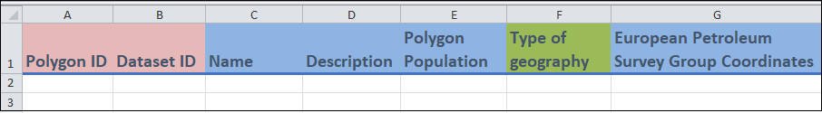

    i)  Columns A and B:
        -   These are identifier fields.

        -   `Polygon ID` (column A) is the unique identifier for this template, and cannot be repeated between entries. A polygon is something that describes the geometry of a geographic area. You can think of each value of `Polygon ID` as representing a unique polygon. This field can be any combination of letters or words up to 30 characters.

        -   For `Dataset ID` (column B), you can repeat the value between entries (if needed). For instance, if you are entering two different polygons from the same dataset, then this column will have the same value.

        -   You may have already created the `Dataset ID` in the `Dataset` template.
    ii) Columns C to E, G:
        -   These are free form fields in which you can enter additional information regarding the Polygon.
        -   `Name` (column C) is the name of the polygon.
        -   `European Petroleum Survey Group Coordinates` (column G) is a coordinate system that can be used to identify where a polygon is.
    iii) Columns F:
         -   For `Type of geography` (column F) of the polygon, you can select one of the values from the drop-down menu.

2.  **Columns H to N**

    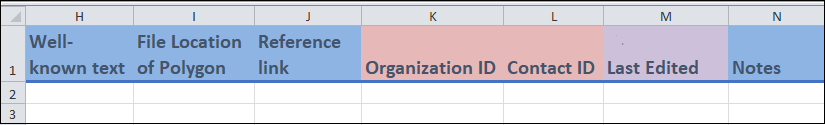

    i)  Columns H to J, M and N:
        -   These are free form fields and a date field in which you can enter relevant information regarding the polygon.

        -   `Well-known text` (column H) refers to the text markup language that can be used to represent the polygon.

        -   `Last edited` (column M) is a date field where you can enter the date when the entry was last updated. This field is used when you modify an entry after your initial recording. Leave this field blank if the measure was entered with no updates.
    ii) Columns K and L:
        -   These are identifier fields in which the `Organization ID` and the `Contact ID` associated with the polygon are entered.

### `Quality reports` template

1.  **Columns A to H**

    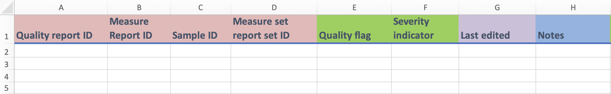

    i)  Columns A to D:
        -   These are identifier fields.

        -   `Quality report ID` (column A) is the unique identifier for this template, and cannot be repeated between entries. You can think of each value of `Quality Report ID` as representing a unique quality issue that you want to report. This field can be any combination of letters or words up to 30 characters.

        -   For the rest of the columns, you can repeat the value between entries (if needed). For instance, if you are entering two different quality reports for the same sample, then the `Sample ID` column will be the same.

        -   You may have already created some of the identifiers in other templates. For instance, you may have already created the `Sample ID` in the `Sample report` template.
    ii) Columns E and F:
        -   `Quality flag` (column E) is a drop-down menu field where you can select the type of quality issue that you would like to enter.
        -   `Severity indicator` (column F) is is also a drop-down menu field where you can indicate the severity of the quality flag.
    iii) Columns G and H:
         -   These are a free form field and a date field in which you can enter the indicated information.
         -   `Last edited` (column M) is a date field where you can enter the date when the entry was last updated. This field is used when you modify an entry after your initial recording. Leave this field blank if the measure was entered with no updates.

### `Sites` template

1.  **Columns A to F**

    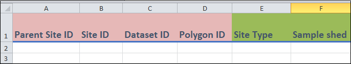

    i)  Columns A to D:
        -   These are identifier fields.

        -   `Site ID` (column B) is the unique identifier for this template, and cannot be repeated between entries. You can think of each value of `Site ID` as representing a unique site. This field can be any combination of letters or words up to 30 characters.

        -   For the rest of the columns, you can repeat the value between entries (if needed). For instance, if you are entering two different sites that are found in the same polygon, then the `Polygon ID` values will be the same.

        -   `Parent site ID` (column A) refers to the site that is parent to the site that is being entered. For example if the site that is being entered is a room in a facility, then the `Parent site ID` would refer to the facility.
    ii) Columns E and F:
        -   These are drop-down menu fields in which you can specify the `Site Type` (column E) and the type of `Sample shed` (column F).

2.  **Columns G to M**

    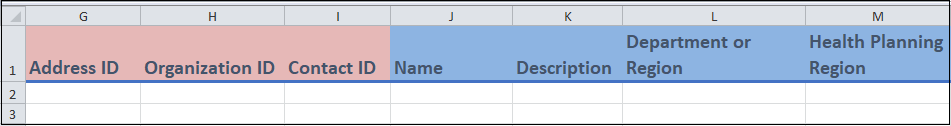

    i)  Columns G to I, L and M:
        -   These are identifier fields that you can use to record additional information about the site. `Primary reporting authority ID` (column L) and `Secondary reporting authority ID` (column M) are `Organization ID`s that you would have created using the `Organization` template.
    ii) Columns J and K:
        -   These are all free form fields in which you can enter in relevant information about the site.

3.  **Columns N to S**

    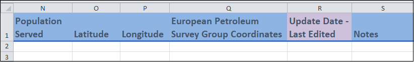

    i)  Columns N to S:
        -   These are free form fields and a date field where you can enter in additional information about the Site.
        -   `European Petroleum Survey Group Coordinates` (column Q) is a coordinate system that can be used to identify where your site is.
        -   `Last Edited` (column S) is a date field where you can enter the date when the entry was last updated. This field is used when you modify an entry after your initial recording. Leave this field blank if the measure was entered with no updates.

You have now entered in your metadata, congratulations!

## Notes regarding templates {#notes-regarding-templates}

### Templates with conditional menus (`Measure report` and `Protocol steps`)

#### Adding more conditional menus

-   The code to determine the entries for the conditional menus are found to the right of the main template. Unlike the main template, the rows containing the code will not be alternating in colour.

-   The code is only present for the first three rows. If you want to use conditional menus for additional rows, you will need to copy the code to these rows as well as create the menus in the desired cells. As an example, pretend that you wanted to add a `Measure` field conditional menu to row 5 in the `Measure report` template. The first thing you would do is copy the code from AF4 to AF5 (see below, all images in this example are from Excel Online).

    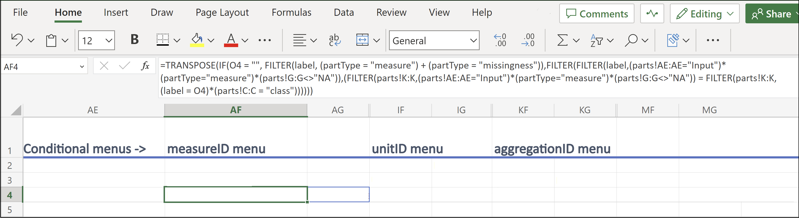

-   Then, to create the new menu, you would go to P5 (which is where the new conditional menu will be located). You would select "Data validation", which is under "Data Tools" in the "Data" tab (it is outlined in red in the image below).

    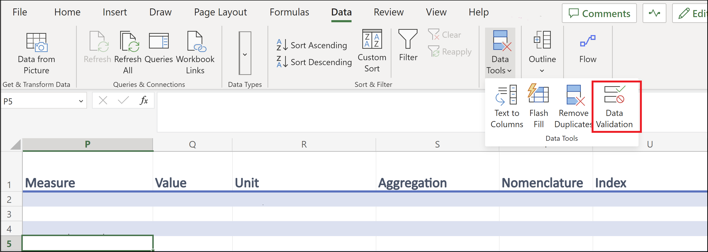

-   Finally, you would select "List" from the "Allow" menu and then enter the following text "=\$AF\$5#" under "Source". The column and row indicators ("AF" and "5", in this example) match up with where you copied the new code ("AF5").

    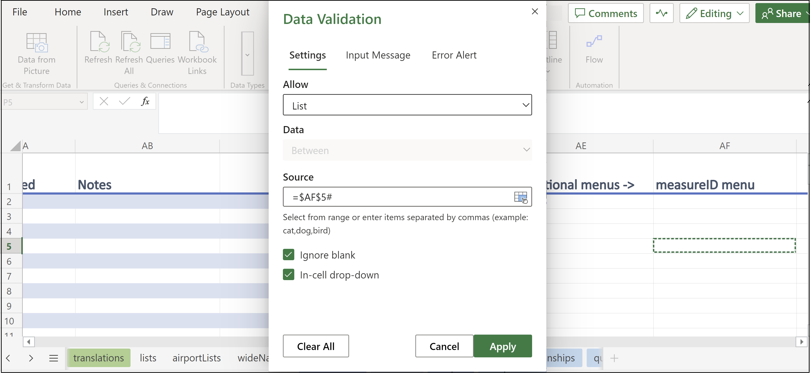

    For additional menus, repeat the above steps. Adding conditional menus in an online environment (such as Excel Online) may slow down the templates considerably.

#### Troubleshooting conditional menus

-   The conditional menus work by searching the `partLabels` column in the `parts` table that is included with the templates.

-   If you obtained an error with these menus check if any changes were made to the `parts` table.

### Templates with menus (all templates other than the `Measure sets`, `Protocols`, `Contact`, `Address` and `Dataset` templates)

#### Part IDs

-   In the main parts of each of the templates, labels are used in the menus.

-   If you wish to have the part IDs of these values, they are located to the right of the main template and, if applicable, the code for the conditional menus. Unlike the main template, the rows containing the part IDs will not be alternating in colour.

-   The part IDs are present in the first 100 rows of each of the templates.

#### Troubleshooting menus (not including conditional menus)

-   The menus are based on what is found in the `lists` tab that is included with the templates.

-   If you obtained an error with these menus check if any changes were made to the `lists` tab.
